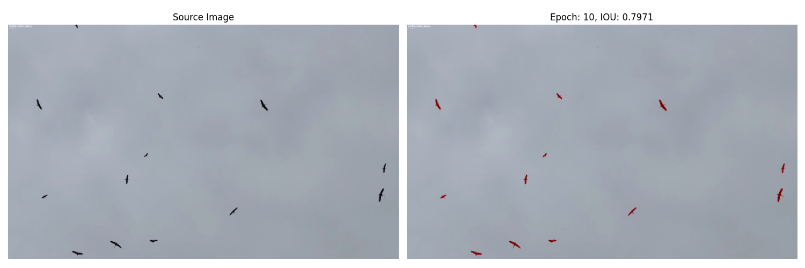

# Bird Image Segmentation
### U-Net, EfficientNetB3 on Tensorflow and Keras


## Overview

As part of my university's machine learning course, I undertook this project of my choice to segment birds from images using deep learning model. 
This repository contains the complete workflow, from data preprocessing to model evaluation.


## Results

From the start, the model did a good job at image segmentation. 
As training went on, there wasn't a big change in how well it performed. 
There were times when the model's predictions seemed better than the real masks from the dataset, which made the scores a bit odd.


### Segmentation Results

Here are a few examples of the segmentation results. On the left is the original image, and on the right is the image overlaid with the predicted segmentation mask. The IOU (Intersection over Union) score is also displayed.

| Original Image / Prediction Overlay |
|:--------------:|
|  |
|  |
|  |
|  |


### Training History

The model's training history shows how the loss and IOU score changed over each epoch.


### Detailed Results

For a more detailed view, here are the original images, true masks, overlay images, and predicted masks:


## Technical Details

### Frameworks and Libraries:
- **TensorFlow**: The primary framework used for building and training the neural network.
- **Keras**: High-level neural networks API, running on top of TensorFlow.
- **Segmentation Models**: Library for building deep learning segmentation models.
- **OpenCV (cv2)**: Used for image processing and manipulation.
- **Albumentations**: Library for efficient image augmentation.
- **NumPy**: Used for numerical operations.
- **matplotlib**: Used for visualizations and plotting.

### Architecture:
- **Type**: U-Net-based segmentation model.
- **Backbone**: EfficientNetB3 (pre-trained on ImageNet)
    
### Segmentation Task:
- Segmenting birds in images.
    
### Optimizer:
- **Type**: Adam
- **Learning Rate**: `0.0001` (can be adjusted during training)
    
### Loss Function:
- Binary Cross-Entropy combined with Jaccard loss (also known as BCE Jaccard Loss)

### Performance Metrics:
- Intersection over Union (IoU) Score with a threshold of `0.5`
- F1-Score with a threshold of `0.5`

### Data Augmentation (Training):
- Resizing to `384x640`
- Padding if needed
- Horizontal flip with a probability of `0.3`
- Vertical flip with a probability of `0.3`

### Data Augmentation (Validation):
- Resizing to `384x640`
- Padding if needed

### Training Configuration:
- **Batch Size**: Configurable (default: `1`)
- **Epochs**: Configurable (default: `10`)
- Early stopping is employed with a patience of `5` epochs. The best model weights are restored upon training interruption.

### Dataset:
- The dataset is split into training, validation, and test sets.
- Custom data loaders are implemented for efficient loading and batching of data.
- Binary thresholding is applied to masks.

### Additional Features:
- Callbacks are set up during training to adjust learning rate, save the best model, and visualize predictions after each epoch.
- The model's performance is plotted after training, showing the progression of IoU and Loss over epochs.
- Post-training, predictions are visualized by overlaying predicted masks on original images and comparing them against true masks. The Intersection over Union (IoU) score is also computed for each prediction.

# What I Learned

1. **Data Management**: I understood the importance of preprocessing and handling image data effectively.
2. **Tool Proficiency**: I familiarized myself with frameworks like TensorFlow and Keras, and employed them to build and train the model.
3. **Model Architectures**: I delved into the U-Net architecture and its applicability in segmentation tasks.
4. **Troubleshooting**: I faced challenges, especially with tracking validation scores, and learned to navigate and rectify them.
5. **First Dip into Production**: This project gave me a taste of what it's like to work on a real-world-like task. It felt different from typical classroom exercises.
6. **Resourcefulness**: While I leaned heavily on online resources, I recognized the importance of independent problem-solving and gained hands-on experience.


## Setup and Run

1. Clone the repository:
   ```bash
   git clone https://github.com/your_username/Bird-Image-Segmentation.git
2. Navigate to the directory and install the required packages:
    ```bash
    cd Bird-Image-Segmentation
    pip install -r requirements.txt
3. Unzip the training data:
        The training dataset is provided as a zip file named birds_splitted.zip in the root directory.
        Unzip this file to get access to birds_splitted directory where you will find train, val and test subdirectories with datasets.
    ```bash
    unzip birds_splitted.zip
4. Run the Jupyter notebook:
    ```bash
    jupyter notebook Bird_Segmentation_Model.ipynb
